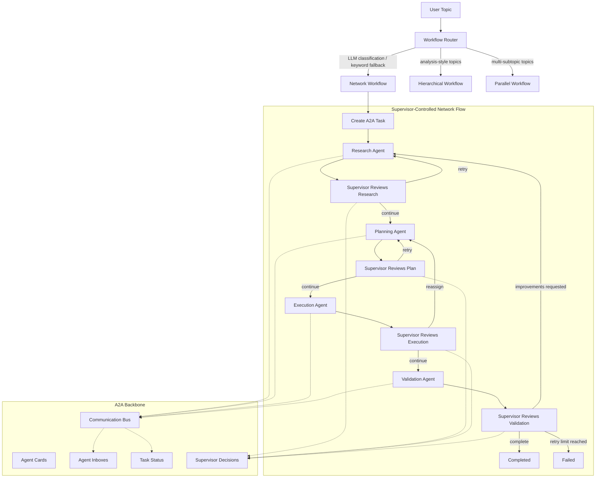

# Production-Style CrewAI Multi-Agent Workflow

A modular CrewAI workflow with five agents, seven tools, YAML-backed
agent/task configuration, A2A-style inter-agent communication, and
supervisor-controlled orchestration — running fully locally on Ollama.

The app supports three workflow patterns:

- `network`: supervisor-controlled sequential handoff with retries and validation.
- `hierarchical`: CrewAI manager/supervisor pattern.
- `parallel`: research and planning run concurrently before execution.

Workflow routing and supervisor phase reviews are **LLM-judged with
structured JSON output**, and fall back to deterministic keyword heuristics
whenever the LLM is disabled, unreachable, or returns unparseable output.

The default LLM backend is Ollama with `llama3.1`.

## Project Structure

```text
.
├── .github/workflows/ci.yml  # Lint/compile + pytest on every push
├── docs/
│   └── workflow-graph.md
├── src/my_crew/
│   ├── a2a/                  # A2A messages, protocol, task lifecycle, bus
│   ├── agents/               # YAML-backed agent factories, supervisor, LLM judge
│   ├── config/               # agents.yaml, tasks.yaml, LLM config
│   ├── tasks/                # YAML-backed task factories
│   ├── tools/                # CrewAI tools
│   ├── utils/                # Logging
│   ├── workflows/            # Network, hierarchical, parallel, router
│   ├── crew.py
│   ├── demo_crew.py          # Manual all-agents demo (requires Ollama)
│   └── main.py               # CLI entry point
├── tests/                    # Pytest suite (no LLM required)
├── Dockerfile
├── docker-compose.yml
├── pyproject.toml            # Single source of truth for dependencies
├── requirements.txt          # Thin pointer: -e .[dev]
├── LICENSE
└── README.md
```

## Agents

Agents are configured in `src/my_crew/config/agents.yaml` and loaded dynamically
through `src/my_crew/agents/factory.py`.

- `Research Agent`
- `Planning Agent`
- `Execution Agent`
- `Validation Agent`
- `Supervisor Agent`

## Tools

Tool names are mapped dynamically through `src/my_crew/tools/registry.py`.

- `Web Search Tool`
- `File Reader Tool`
- `Memory Tool`
- `Logger Tool`
- `Calculator Tool`
- `Notification Tool`
- `API Tool`

The web search tool accepts any topic and uses `duckduckgo-search`. If network
access is unavailable, it returns a clean tool error instead of crashing the
workflow.

## A2A And Supervision

The A2A layer includes:

- agent cards and capabilities
- protocol-level message validation
- per-agent inboxes
- task lifecycle/status updates
- pub-sub/broadcast support
- async dispatch support
- streaming chunk support

The network workflow uses `SupervisorController` to inspect phase outputs and
decide whether to continue, retry, reassign, fail, or complete.

### LLM-judged supervision with deterministic fallback

For each completed phase, the supervisor asks the LLM for a structured JSON
review (`verdict`, `needs_improvement`, `feedback`) via
`src/my_crew/agents/llm_judge.py`:

- `fail` verdicts trigger a retry (or reassignment to planning when the
  execution phase fails).
- `needs_improvement` on validation restarts the workflow from research
  (bounded by the retry limit); on other phases it retries that phase with the
  feedback injected into the next prompt.
- If the LLM is disabled, unreachable, or returns unparseable output, the
  supervisor falls back to deterministic keyword heuristics, so the workflow
  never stalls on a broken judge.

Topic-to-workflow routing works the same way: LLM classification first,
keyword heuristics as fallback.

Both judges can be disabled via environment variables:

```text
MY_CREW_LLM_SUPERVISOR=0   # heuristic-only phase reviews
MY_CREW_LLM_ROUTING=0      # keyword-only workflow routing
```

## Workflow Graph

The full graph is also available at `docs/workflow-graph.md`.



## Local Setup

Create and activate a virtual environment:

```bash
python3 -m venv venv
source venv/bin/activate
```

Install the project with dev dependencies:

```bash
pip install --upgrade pip
pip install -e ".[dev]"
```

Start Ollama in another terminal:

```bash
ollama serve
```

Pull the model:

```bash
ollama pull llama3.1
```

## Usage

Run interactively (prompts for a topic):

```bash
my-crew
```

Or non-interactively with explicit options:

```bash
my-crew --topic "Future of AI Agents"
my-crew --topic "analysis of agent orchestration" --workflow hierarchical
my-crew --topic "quick check" --no-report
```

Each run saves the full result as a Markdown report under `reports/`.

Routing examples (keyword fallback shown; the LLM router may choose
differently based on topic semantics):

- `Future of AI Agents` -> network workflow
- `analysis of agent orchestration` -> hierarchical workflow
- `multiple AI workflow strategies` -> parallel workflow

## Docker Setup

Build the image:

```bash
docker compose build
```

Start Ollama:

```bash
docker compose up -d ollama
```

Pull `llama3.1` into the Docker volume:

```bash
docker compose run --rm ollama-pull
```

Run the app interactively:

```bash
docker compose run --rm app
```

Stop services:

```bash
docker compose down
```

Remove the Ollama model volume if needed:

```bash
docker compose down -v
```

## Configuration

The app uses these environment variables:

```text
OLLAMA_MODEL=llama3.1
OLLAMA_BASE_URL=http://localhost:11434
MY_CREW_LLM_SUPERVISOR=1   # set to 0 for heuristic-only supervision
MY_CREW_LLM_ROUTING=1      # set to 0 for keyword-only routing
MY_CREW_LOG_LEVEL=INFO
```

Inside Docker Compose, `OLLAMA_BASE_URL` is set to:

```text
http://ollama:11434
```

Agent and task prompts live in:

```text
src/my_crew/config/agents.yaml
src/my_crew/config/tasks.yaml
```

## Testing

The unit test suite covers the supervisor controller (heuristic and
LLM-judged paths), the A2A communication bus and protocol, workflow routing,
and YAML/tool configuration — no Ollama or network access required:

```bash
pytest
```

The same suite runs in GitHub Actions on every push and pull request
(`.github/workflows/ci.yml`).

Validate Docker Compose syntax:

```bash
docker compose config
```

## Expected Runtime Output

Successful network workflow output includes these sections:

```text
RESEARCH RESULT
PLANNING RESULT
EXECUTION RESULT
VALIDATION RESULT
SUPERVISOR DECISIONS
A2A TASK SNAPSHOT
A2A MESSAGE COUNT
```

## Notes

- Full execution requires Ollama and the configured model.
- Web search requires network access.
- The Docker setup pulls `llama3.1` into the `ollama-data` volume.
- `src/my_crew/demo_crew.py` is a manual all-agents demo:
  `PYTHONPATH=src python -m my_crew.demo_crew`.
