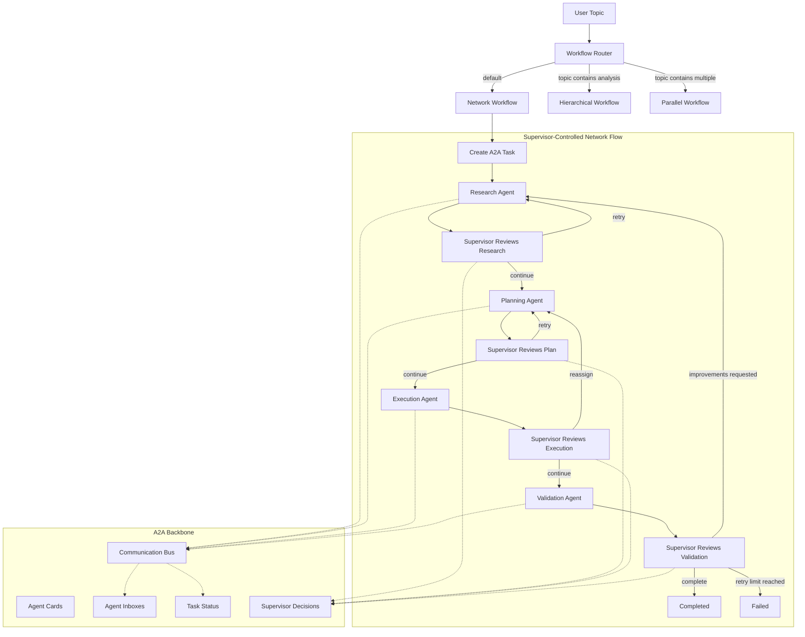

# Production-Style CrewAI Multi-Agent Workflow

This project implements a modular CrewAI workflow with five agents, seven tools,
YAML-backed agent/task configuration, A2A-style inter-agent communication, and
supervisor-controlled orchestration.

The app supports three workflow patterns:

- `network`: supervisor-controlled sequential handoff with retries and validation.
- `hierarchical`: CrewAI manager/supervisor pattern.
- `parallel`: research and planning run concurrently before execution.

The default LLM backend is Ollama with `llama3.1`.

## Project Structure

```text
.
├── docs/
│   └── workflow-graph.md
├── src/my_crew/
│   ├── a2a/                  # A2A messages, protocol, task lifecycle, bus
│   ├── agents/               # YAML-backed agent factories and supervisor
│   ├── config/               # agents.yaml, tasks.yaml, LLM config
│   ├── tasks/                # YAML-backed task factories
│   ├── tools/                # CrewAI tools
│   ├── workflows/            # Network, hierarchical, parallel, router
│   ├── crew.py
│   └── main.py
├── Dockerfile
├── docker-compose.yml
├── pyproject.toml
├── requirements.txt
└── README.md
```

## Agents

Agents are configured in `src/my_crew/config/agents.yaml` and loaded dynamically
through `src/my_crew/agents/factory.py`.

- `Research Agent`
- `Planning Agent`
- `Execution Agent`
- `Validation Agent`
- `Supervisor Agent`

## Tools

Tool names are mapped dynamically through `src/my_crew/tools/registry.py`.

- `Web Search Tool`
- `File Reader Tool`
- `Memory Tool`
- `Logger Tool`
- `Calculator Tool`
- `Notification Tool`
- `API Tool`

The web search tool accepts any topic and uses `duckduckgo-search`. If network
access is unavailable, it returns a clean tool error instead of crashing the
workflow.

## A2A And Supervision

The A2A layer includes:

- agent cards and capabilities
- protocol-level message validation
- per-agent inboxes
- task lifecycle/status updates
- pub-sub/broadcast support
- async dispatch support
- streaming chunk support

The network workflow uses `SupervisorController` to inspect phase outputs and
decide whether to continue, retry, reassign, fail, or complete.

## Workflow Graph

The full graph is also available at `docs/workflow-graph.md`.



## Local Setup

Create and activate a virtual environment:

```bash
python3 -m venv venv
source venv/bin/activate
```

Install dependencies:

```bash
pip install --upgrade pip
pip install -r requirements.txt
pip install -e .
```

Start Ollama in another terminal:

```bash
ollama serve
```

Pull the model:

```bash
ollama pull llama3.1
```

Run the app:

```bash
PYTHONPATH=src python -m my_crew.main
```

Then enter a topic when prompted.

Routing examples:

- `Future of AI Agents` -> network workflow
- `analysis of agent orchestration` -> hierarchical workflow
- `multiple AI workflow strategies` -> parallel workflow

## Docker Setup

Build the image:

```bash
docker compose build
```

Start Ollama:

```bash
docker compose up -d ollama
```

Pull `llama3.1` into the Docker volume:

```bash
docker compose run --rm ollama-pull
```

Run the app interactively:

```bash
docker compose run --rm app
```

Stop services:

```bash
docker compose down
```

Remove the Ollama model volume if needed:

```bash
docker compose down -v
```

## Configuration

The app uses these environment variables:

```text
OLLAMA_MODEL=llama3.1
OLLAMA_BASE_URL=http://localhost:11434
```

Inside Docker Compose, `OLLAMA_BASE_URL` is set to:

```text
http://ollama:11434
```

Agent and task prompts live in:

```text
src/my_crew/config/agents.yaml
src/my_crew/config/tasks.yaml
```

## Verification Commands

Compile the source tree:

```bash
source venv/bin/activate
python -m compileall src/my_crew
```

Validate YAML-backed agent/task creation:

```bash
PYTHONPATH=src python - <<'PY'
from my_crew.config.loader import load_yaml_config
from my_crew.agents.researcher import create_research_agent
from my_crew.agents.supervisor import create_supervisor_agent
from my_crew.tasks.planning_task import create_planning_task

agents = load_yaml_config("agents.yaml")
tasks = load_yaml_config("tasks.yaml")
research = create_research_agent()
manager = create_supervisor_agent(is_manager=True)
task = create_planning_task(
    research,
    "Future of AI Agents",
    "Sample research context",
)

print("agents:", sorted(agents))
print("tasks:", sorted(tasks))
print("research role:", research.role)
print("research tools:", len(research.tools))
print("manager tools:", len(manager.tools))
print("topic injected:", "Future of AI Agents" in task.description)
print("context injected:", "Sample research context" in task.description)
PY
```

Validate supervisor decisions without running the LLM:

```bash
PYTHONPATH=src python - <<'PY'
from my_crew.a2a.communication import CommunicationBus
from my_crew.a2a.message import AgentCard
from my_crew.agents.supervisor_controller import SupervisorController

bus = CommunicationBus()
for name in [
    "Supervisor Agent",
    "Research Agent",
    "Planning Agent",
    "Execution Agent",
    "Validation Agent",
]:
    bus.register_agent(AgentCard(agent_id=name, name=name, description=name))

task = bus.create_task("supervisor test", "Supervisor Agent")
supervisor = SupervisorController(
    bus=bus,
    task_id=task.task_id,
    max_retries_per_phase=1,
    min_output_chars=10,
)

print(supervisor.evaluate_phase_output(
    "research",
    "This is a good research output with enough detail.",
    "planning",
    "Planning Agent",
).action.value)

print(supervisor.evaluate_phase_output(
    "execution",
    "Error: failed execution",
    "validation",
    "Validation Agent",
).action.value)

print(supervisor.evaluate_phase_output(
    "validation",
    "needs improvement in scope and completeness",
    None,
    None,
).next_phase)
PY
```

Expected output:

```text
continue
reassign
research
```

Validate Docker Compose syntax:

```bash
docker compose config
```

## Expected Runtime Output

Successful network workflow output includes these sections:

```text
RESEARCH RESULT
PLANNING RESULT
EXECUTION RESULT
VALIDATION RESULT
SUPERVISOR DECISIONS
A2A TASK SNAPSHOT
A2A MESSAGE COUNT
```

## Notes

- Full execution requires Ollama and the configured model.
- Web search requires network access.
- The Docker setup pulls `llama3.1` into the `ollama-data` volume.
