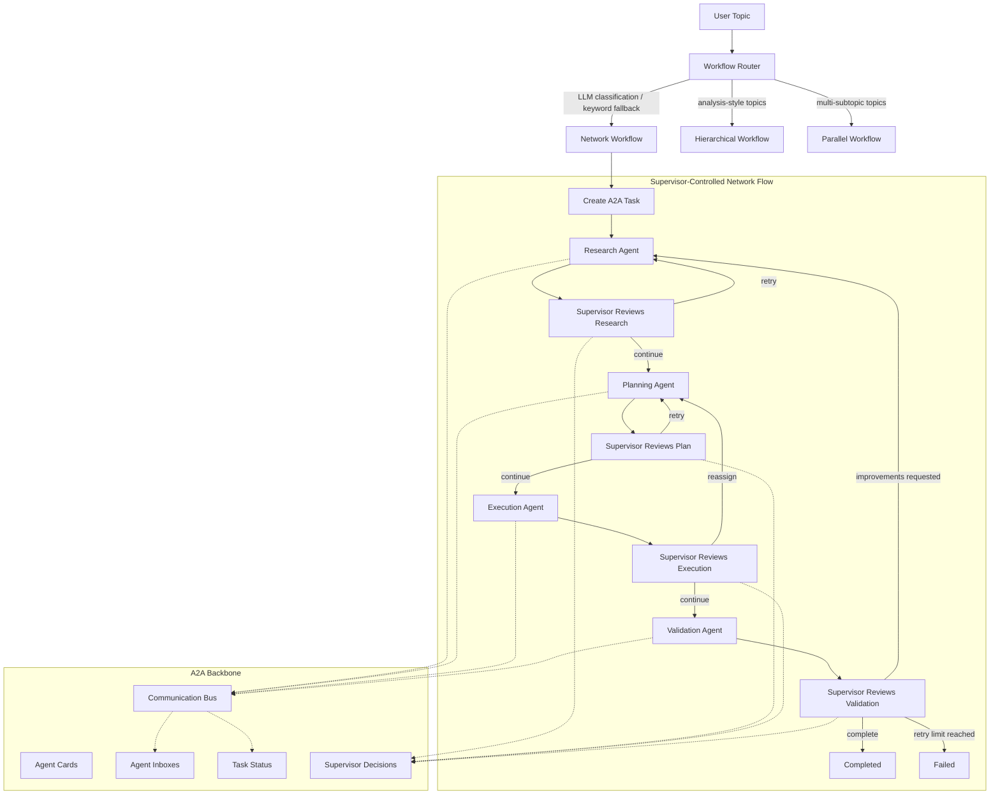

# Production-Style CrewAI Multi-Agent Workflow

[](https://github.com/serfcde/AgentAI/actions/workflows/ci.yml)

A modular CrewAI workflow with five agents, seven tools, YAML-backed
agent/task configuration, **Google A2A protocol** inter-agent communication
(official `a2a-sdk` types), and supervisor-controlled orchestration — running
fully locally on Ollama.

The app supports three workflow patterns:

- `network`: supervisor-controlled sequential handoff with retries and validation.
- `hierarchical`: CrewAI manager/supervisor pattern.
- `parallel`: research and planning run concurrently before execution.

Workflow routing and supervisor phase reviews are **LLM-judged with
structured JSON output**, and fall back to deterministic keyword heuristics
whenever the LLM is disabled, unreachable, or returns unparseable output.

The default LLM backend is Ollama with `llama3.1`.

## Project Structure

```text
.
├── .github/workflows/ci.yml  # Lint/compile + pytest on every push
├── docs/
│   └── workflow-graph.md
├── src/my_crew/
│   ├── a2a/                  # Google A2A types, protocol, in-process bus
│   ├── agents/               # YAML-backed agent factories, supervisor, LLM judge
│   ├── config/               # agents.yaml, tasks.yaml, LLM config
│   ├── tasks/                # YAML-backed task factories
│   ├── tools/                # CrewAI tools (incl. SQLite-backed memory)
│   ├── utils/                # Logging, per-phase metrics
│   ├── workflows/            # Network, hierarchical, parallel, router
│   ├── api.py                # FastAPI service with SSE streaming
│   ├── crew.py
│   ├── demo_crew.py          # Manual all-agents demo (requires Ollama)
│   ├── evaluation.py         # my-crew-eval: compare workflow patterns
│   └── main.py               # CLI entry point
├── tests/                    # Pytest suite (no LLM required)
├── Dockerfile
├── docker-compose.yml
├── pyproject.toml            # Single source of truth for dependencies
├── requirements.txt          # Thin pointer: -e .[dev]
├── LICENSE
└── README.md
```

## Agents

Agents are configured in `src/my_crew/config/agents.yaml` and loaded dynamically
through `src/my_crew/agents/factory.py`.

- `Research Agent`
- `Planning Agent`
- `Execution Agent`
- `Validation Agent`
- `Supervisor Agent`

## Tools

Tool names are mapped dynamically through `src/my_crew/tools/registry.py`.

- `Web Search Tool`
- `File Reader Tool`
- `Memory Tool`
- `Logger Tool`
- `Calculator Tool`
- `Notification Tool`
- `API Tool`

The web search tool accepts any topic and uses `duckduckgo-search`. If network
access is unavailable, it returns a clean tool error instead of crashing the
workflow.

The memory tool is **SQLite-backed and persistent across runs** (path
configurable via `MY_CREW_MEMORY_DB`, default `my_crew_memory.db`).

## A2A And Supervision

Inter-agent communication uses the **official Google A2A protocol types**
from [`a2a-sdk`](https://pypi.org/project/a2a-sdk/) (A2A v1 specification):

- `AgentCard` with `AgentSkill`/`AgentCapabilities` per agent
- `Message` with `Part`s, roles, and task/context IDs
- `Task` with spec `TaskState` lifecycle (submitted/working/completed/failed/...)
  and full message history
- wire serialization via the spec's canonical JSON mapping, using the official
  `SendMessageRequest` envelope — payloads are interoperable with any A2A v1
  implementation

`CommunicationBus` (`src/my_crew/a2a/communication.py`) is the local
in-process transport that stands in for HTTP/gRPC: it routes A2A messages to
per-agent inboxes and adds pub-sub, broadcast, async dispatch, and streaming
chunk support. Because A2A addresses agents at the transport level,
sender/receiver metadata travels in `Message.metadata`.

The network workflow uses `SupervisorController` to inspect phase outputs and
decide whether to continue, retry, reassign, fail, or complete. The parallel
workflow reuses the same controller: research and planning outputs are
reviewed after the concurrent phase, retried once with supervisor feedback if
rejected, and all decisions appear in the final output.

Every network-flow phase is also measured (wall-clock duration, output size,
and token usage when available) and reported in a `PHASE METRICS` section via
`src/my_crew/utils/metrics.py`.

### LLM-judged supervision with deterministic fallback

For each completed phase, the supervisor asks the LLM for a structured JSON
review (`verdict`, `needs_improvement`, `feedback`) via
`src/my_crew/agents/llm_judge.py`:

- `fail` verdicts trigger a retry (or reassignment to planning when the
  execution phase fails).
- `needs_improvement` on validation restarts the workflow from research
  (bounded by the retry limit); on other phases it retries that phase with the
  feedback injected into the next prompt.
- If the LLM is disabled, unreachable, or returns unparseable output, the
  supervisor falls back to deterministic keyword heuristics, so the workflow
  never stalls on a broken judge.

Topic-to-workflow routing works the same way: LLM classification first,
keyword heuristics as fallback.

Both judges can be disabled via environment variables:

```text
MY_CREW_LLM_SUPERVISOR=0   # heuristic-only phase reviews
MY_CREW_LLM_ROUTING=0      # keyword-only workflow routing
```

## Workflow Graph

The full graph is also available at `docs/workflow-graph.md`.



## Local Setup

Create and activate a virtual environment:

```bash
python3 -m venv venv
source venv/bin/activate
```

Install the project with dev dependencies:

```bash
pip install --upgrade pip
pip install -e ".[dev]"
```

Start Ollama in another terminal:

```bash
ollama serve
```

Pull the model:

```bash
ollama pull llama3.1
```

## Usage

Run interactively (prompts for a topic):

```bash
my-crew
```

Or non-interactively with explicit options:

```bash
my-crew --topic "Future of AI Agents"
my-crew --topic "analysis of agent orchestration" --workflow hierarchical
my-crew --topic "quick check" --no-report
```

Each run saves the full result as a Markdown report under `reports/`.

### Comparing workflow patterns

The evaluation harness runs the same topic through all three workflow
patterns and compares duration, output size, and an LLM quality score
(1-10), then writes a Markdown comparison report to `reports/eval-*.md`:

```bash
my-crew-eval --topic "Future of AI Agents"
my-crew-eval --topic "..." --workflows network parallel
```

Routing examples (keyword fallback shown; the LLM router may choose
differently based on topic semantics):

- `Future of AI Agents` -> network workflow
- `analysis of agent orchestration` -> hierarchical workflow
- `multiple AI workflow strategies` -> parallel workflow

### HTTP API with live streaming

Start the FastAPI service:

```bash
my-crew-api
# or: uvicorn my_crew.api:app --reload
```

Endpoints:

```text
POST /workflows                  {"topic": "...", "workflow": "auto"}  -> 202 + job_id
GET  /workflows/{job_id}         job status, error, and final result
GET  /workflows/{job_id}/stream  Server-Sent Events: live A2A messages,
                                 routing decisions, and the final result
GET  /health                     liveness probe
```

Example:

```bash
JOB=$(curl -s -X POST localhost:8000/workflows \
  -H 'Content-Type: application/json' \
  -d '{"topic": "Future of AI Agents"}' | python -c 'import sys,json;print(json.load(sys.stdin)["job_id"])')

curl -N "localhost:8000/workflows/$JOB/stream"   # watch agents talk live
curl -s "localhost:8000/workflows/$JOB"          # final result
```

## Docker Setup

Build the image:

```bash
docker compose build
```

Start Ollama:

```bash
docker compose up -d ollama
```

Pull `llama3.1` into the Docker volume:

```bash
docker compose run --rm ollama-pull
```

Run the app interactively:

```bash
docker compose run --rm app
```

Start the HTTP API on port 8000:

```bash
docker compose up api
```

Compare workflow patterns (writes to `./reports`):

```bash
docker compose run --rm eval --topic "Future of AI Agents"
```

Stop services:

```bash
docker compose down
```

Remove the Ollama model volume if needed:

```bash
docker compose down -v
```

## Configuration

The app uses these environment variables:

```text
OLLAMA_MODEL=llama3.1
OLLAMA_BASE_URL=http://localhost:11434
MY_CREW_LLM_SUPERVISOR=1        # set to 0 for heuristic-only supervision
MY_CREW_LLM_ROUTING=1           # set to 0 for keyword-only routing
MY_CREW_LLM_SCORING=1           # set to 0 to skip LLM scores in my-crew-eval
MY_CREW_MEMORY_DB=my_crew_memory.db   # persistent memory tool database
MY_CREW_API_HOST=127.0.0.1      # my-crew-api bind host
MY_CREW_API_PORT=8000           # my-crew-api port
MY_CREW_LOG_LEVEL=INFO
```

Inside Docker Compose, `OLLAMA_BASE_URL` is set to:

```text
http://ollama:11434
```

Agent and task prompts live in:

```text
src/my_crew/config/agents.yaml
src/my_crew/config/tasks.yaml
```

## Testing

The unit test suite covers the supervisor controller (heuristic and
LLM-judged paths), the A2A communication bus and protocol, workflow routing,
and YAML/tool configuration — no Ollama or network access required:

```bash
pytest
```

### Continuous integration (GitHub Actions)

`.github/workflows/ci.yml` runs automatically on every push to `main` and on
every pull request. GitHub spins up an Ubuntu runner that installs Python
3.11, installs the project (`pip install -e ".[dev]"`, with pip caching),
byte-compiles the source tree, and runs the pytest suite with the LLM judges
disabled (`MY_CREW_LLM_SUPERVISOR=0`, `MY_CREW_LLM_ROUTING=0`) so no Ollama
instance is needed. A failing test blocks the green checkmark on the commit
or PR.

Validate Docker Compose syntax:

```bash
docker compose config
```

## Expected Runtime Output

Successful network workflow output includes these sections:

```text
RESEARCH RESULT
PLANNING RESULT
EXECUTION RESULT
VALIDATION RESULT
SUPERVISOR DECISIONS
A2A TASK SNAPSHOT
A2A MESSAGE COUNT
```

## Notes

- Full execution requires Ollama and the configured model.
- Web search requires network access.
- The Docker setup pulls `llama3.1` into the `ollama-data` volume.
- `src/my_crew/demo_crew.py` is a manual all-agents demo:
  `PYTHONPATH=src python -m my_crew.demo_crew`.
