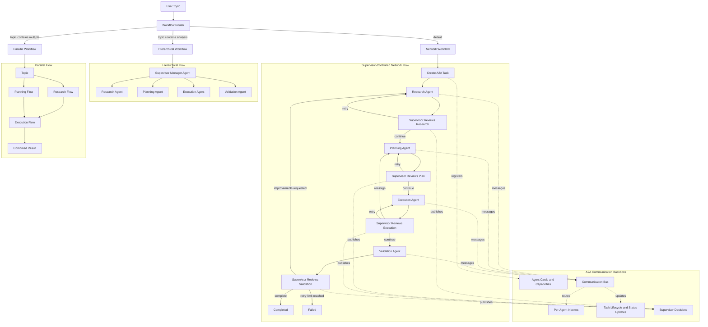

# Workflow Graph

```mermaid
flowchart TD
    User[User Topic] --> Router[Workflow Router]
    Router -->|default| Network[Network Workflow]
    Router -->|topic contains analysis| Hierarchical[Hierarchical Workflow]
    Router -->|topic contains multiple| Parallel[Parallel Workflow]

    subgraph A2A[A2A Communication Backbone]
        Cards[Agent Cards and Capabilities]
        Bus[Communication Bus]
        Inbox[Per-Agent Inboxes]
        Status[Task Lifecycle and Status Updates]
        Decisions[Supervisor Decisions]
    end

    subgraph NetworkFlow[Supervisor-Controlled Network Flow]
        NStart[Create A2A Task] --> R[Research Agent]
        R --> S1[Supervisor Reviews Research]
        S1 -->|continue| P[Planning Agent]
        S1 -->|retry| R
        P --> S2[Supervisor Reviews Plan]
        S2 -->|continue| E[Execution Agent]
        S2 -->|retry| P
        E --> S3[Supervisor Reviews Execution]
        S3 -->|continue| V[Validation Agent]
        S3 -->|reassign| P
        S3 -->|retry| E
        V --> S4[Supervisor Reviews Validation]
        S4 -->|complete| Done[Completed]
        S4 -->|improvements requested| R
        S4 -->|retry limit reached| Failed[Failed]
    end

    subgraph HierarchicalFlow[Hierarchical Flow]
        HSupervisor[Supervisor Manager Agent] --> HResearch[Research Agent]
        HSupervisor --> HPlanning[Planning Agent]
        HSupervisor --> HExecution[Execution Agent]
        HSupervisor --> HValidation[Validation Agent]
    end

    subgraph ParallelFlow[Parallel Flow]
        PTopic[Topic] --> PR[Research Flow]
        PTopic --> PP[Planning Flow]
        PR --> PE[Execution Flow]
        PP --> PE
        PE --> PDone[Combined Result]
    end

    Network --> NStart
    Hierarchical --> HSupervisor
    Parallel --> PTopic

    NStart -.registers.-> Cards
    R -.messages.-> Bus
    P -.messages.-> Bus
    E -.messages.-> Bus
    V -.messages.-> Bus
    Bus -.routes.-> Inbox
    Bus -.updates.-> Status
    S1 -.publishes.-> Decisions
    S2 -.publishes.-> Decisions
    S3 -.publishes.-> Decisions
    S4 -.publishes.-> Decisions
```
